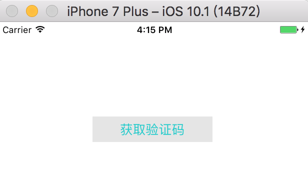
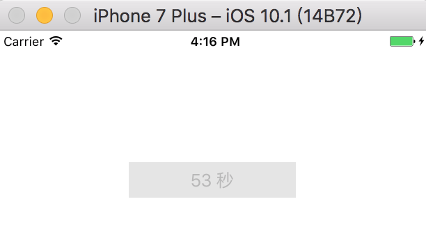

# 一个有倒计时功能的 UIButton

一个自定义的 UIButton，见下图：






## 用法

### 导入源文件
将 CountdownButton.m/.h 拖到项目中。

### 创建实例

拖一个 UIButton 到故事板，将 class 改为 CountdownButton。为按钮建立 IBOutlet 连接,设置按钮的布局约束和属性(Type 指定为 Custom)，用法和 UIButton 没有区别。

> 你也可以用代码创建实例，比如使用 initWithFrame/buttonWithType 方法创建实例。

### 设置按钮属性
在 viewDidLoad 方法中设置按钮的属性：

```swift	
	[_button setTitle: @"获取验证码" forState:UIControlStateNormal];
	_button.nextTitle = @"重新获取";
_button.countdownFormat = @"%2d秒后重新获取";
   _button.maxCountdown = 10;
	_button.updateInterval = 0.1;
	_button.borderWidth = 1;
	_button.borderColor = [UIColor whiteColor];
	_button.cornerRadius = 14;
```

* nextTitle 字符串当倒计时清零（结束）时，显示在按钮标题上。
* countDownFormat 属性用于计数时设置按钮标题的格式，你可以不用设置，默认就是 @"%d秒"。
* maxCoundown 属性是倒计数时间，默认为 60 秒。
* updateInterval 属性指定倒计时的刷新间隔时间，为性能考虑，默认为 1 秒。这个值设得越小，倒计时刷新的间隔就越短。
* borderWidth 属性是按钮的边框粗细，单位是像素。
* borderColor 属性是边框色。
* conerRadius 属性，按钮圆角半径。

### 开始倒计时

在按钮的 IBAction 方法中调用 countdown 方法：

```swift
- (IBAction)buttonAction:(id)sender {
    [_button countdown];
    [self.view makeToast:@"验证码发送成功，请注意查收短信"];
}
```

### 停止倒计时

在 view controller 的 viewWillDisappear 方法中调用 stopCountdown 方法停止定时器，否则 CADisplayLink 会无法释放，从而导致内存泄漏：

```swift
-(void)viewWillDisappear:(BOOL)animated{
    [super viewWillDisappear:animated];
    [_sendButton stopCountdown];
}
```